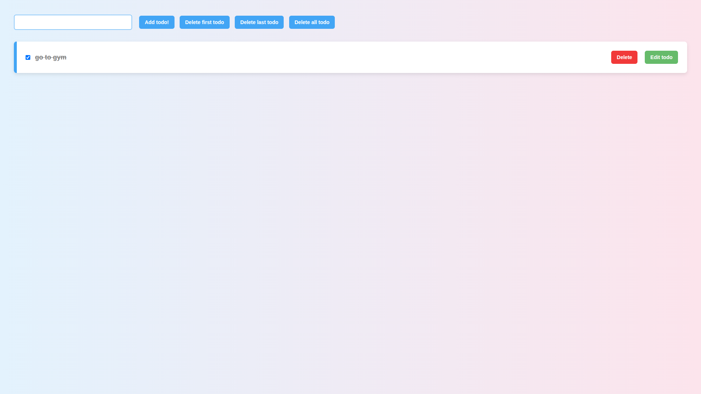

# 📝 Todo App with Strikeout

A simple **Todo List application** built with **HTML, CSS, and
JavaScript** that allows users to:\
- Add, edit, and delete todos\
- Mark todos as completed (with strikeout effect)\
- Persist data in **localStorage** so todos remain after page refresh\
- Clear todos individually or all at once

🌐 **Live Demo**: \[Your Vercel/GitHub Pages link here\]

------------------------------------------------------------------------

## 🚀 Features

✅ Add new todos\
✅ Delete first, last, or all todos\
✅ Delete a specific todo\
✅ Edit existing todos with save functionality\
✅ Mark todos as **completed (strikeout style)**\
✅ Todos are saved in **localStorage** for persistence\
✅ Modern UI with gradient background and styled buttons

------------------------------------------------------------------------

## 🛠️ Technologies Used

-   **HTML5** -- Structure\
-   **CSS3** -- Styling with gradients, hover effects, and
    responsiveness\
-   **JavaScript** -- App logic & localStorage handling

------------------------------------------------------------------------

## 📂 Project Structure

    todo-app/
    │── index.html   # Main HTML file (contains script & styles)

------------------------------------------------------------------------

## ⚡ Getting Started

### 1. Clone the repo

``` bash
git clone https://github.com/adhithiyan3/Todu-appl.git
cd todo-app
```

### 2. Open in browser

Just open `index.html` in your browser.\
No build tools or servers required 🚀

------------------------------------------------------------------------

## 🎯 How to Use

1.  Type a todo in the input box and click **Add todo!**\
2.  Use the checkboxes to mark as completed (strikeout effect)\
3.  Edit or delete specific todos with their respective buttons\
4.  Use **Delete first / Delete last / Delete all** for quick actions\
5.  Todos are saved automatically in **localStorage**

------------------------------------------------------------------------

## 📸 Preview



------------------------------------------------------------------------

## 📌 Future Improvements

-   Add categories or tags for todos\
-   Add a filter (All / Completed / Pending)\
-   Better responsive design for mobile view

------------------------------------------------------------------------

## 👨‍💻 Author

Developed by **\[ADHITHIYAN M\]** ✨
